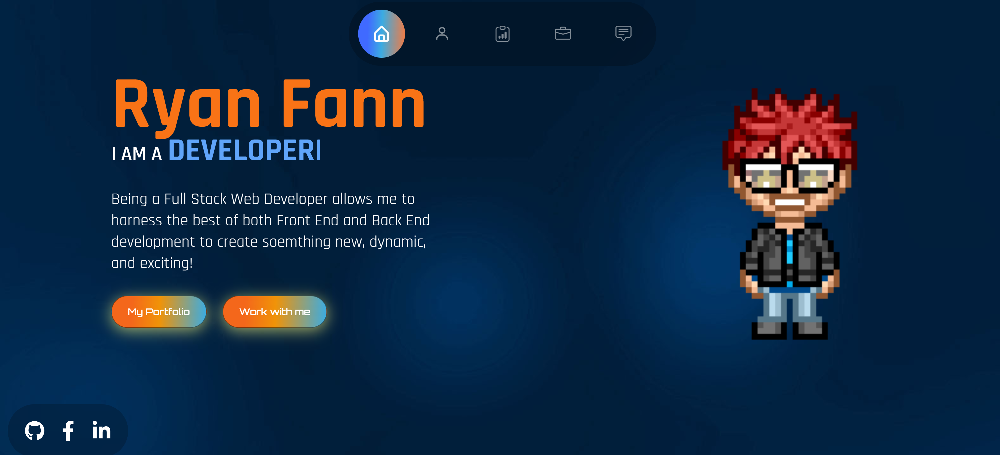

# Ryan Fann's Developer Portfolio

---

## Description

A portfolio built using React to showcase my latest projects and ideas in Web Development.

---

## Table of Contents

1. [Credits](#Credits)
2. [Screenshots](#screenshot)
3. [License](#license)
4. [Links](#links)
5. [Questions](#support)

---

## Credits

Inspired by this tutorial: https://www.youtube.com/watch?v=Hps-XPN1GeE

---

## Screenshots

---

## License

## [MIT](url)

---

## Links

### Repo Link:

https://github.com/8BitGinger/fanntasticPortfolio

### Deployed Link:

https://8bitginger.github.io/fanntasticPortfolio/

---

## Questions

Reach out for Questions or Support here:

### Email:

ryan.fann@gmaiil.com

#### GitHub Username:

[8BitGinger](https://github.com/8BitGinger)
